# Back In Time

This is my write-up for the "Back in Time" section of Bellingcat's Open Source Challenge, a set of OSINT exercises covering techniques like reverse image search, metadata analysis, and advanced search operators (Google dorking).

This was my first OSINT write-up, and I've kept the dead ends and wrong turns in here intentionally, since they show the actual investigative process rather than just the final answers. If you spot a faster or better approach, I'd welcome the feedback.

---

## 1. Fresh Faced

**Goal:** Your task is to find footage of this interview on YouTube, and provide the code at the end of the link (answer format: `dQw4w9WgXcQ`).

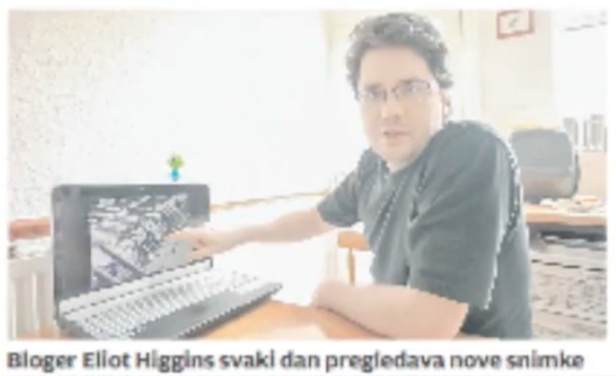

This is the simplest one to find. All I did was a reverse image search and found this:

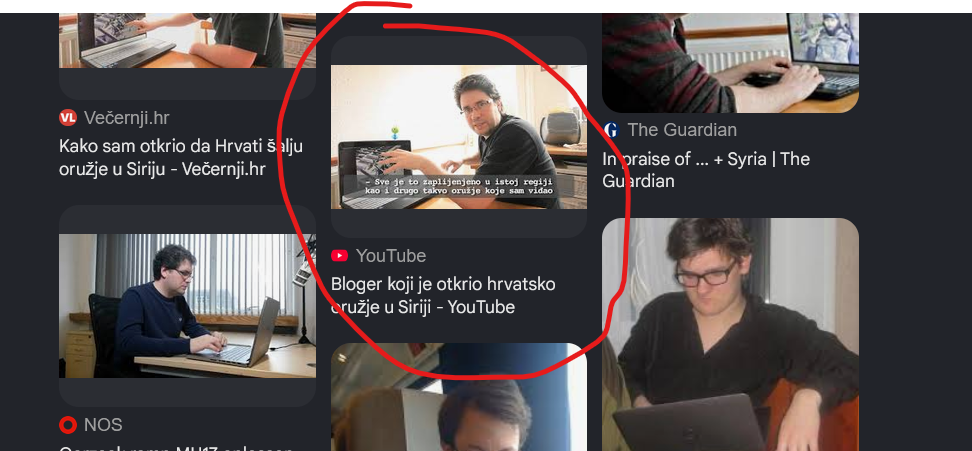

The photo was taken at this specific timestamp: **1:51**.

Now all I had to do was copy-paste the ID of the video:
* `https://www.youtube.com/watch?v=k7qd4Y6QAfY`
* `k7qd4Y6QAfY`

And paste it into the answer box.

.png)

**Answer:** `k7qd4Y6QAfY`

---

## 2. Training Time

**Goal:** Your task is to identify the name of the room seen in the photo (answer format: `The Name Of The Room`).

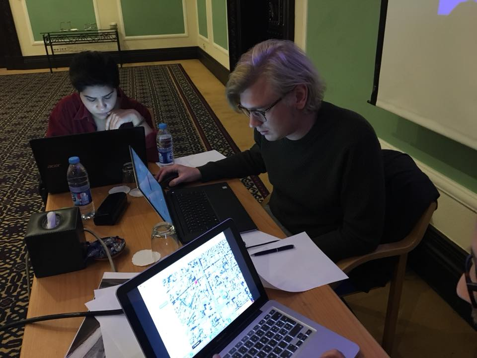

For this one, I searched for workshops by Christiaan Triebert in Dec 2017.

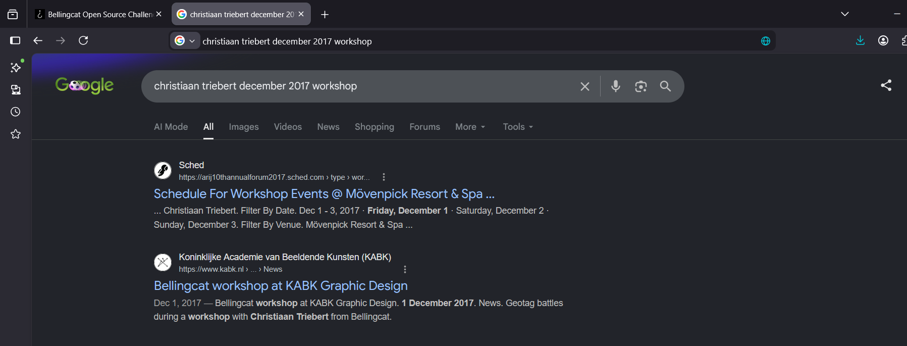
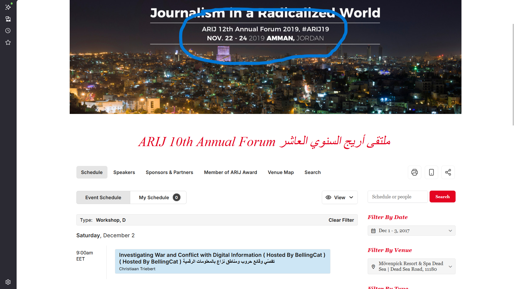

I took note of the first address in the title card of the page; it was held in Amman, Jordan. I clicked on the event link and saw **Al Diwan 1**. I thought it was an address.

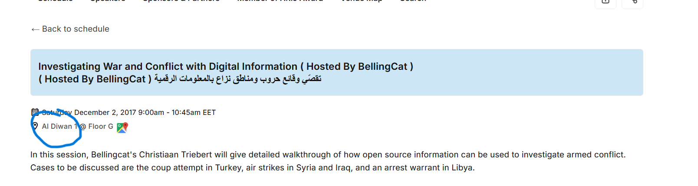

In order to be sure, I searched it and found out that it's a meeting room name at a hotel named *Movenpick Hotels & Resorts*.

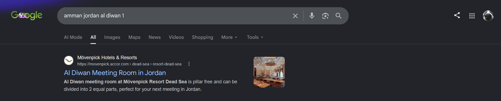

This couldn't be it, this doens't look like the same room, and the wall is green. So, I tried finding other rooms in the hotel and finally found it. 

The wall color, unique carpet pattern, and wall design look identical to the challenge photo. 

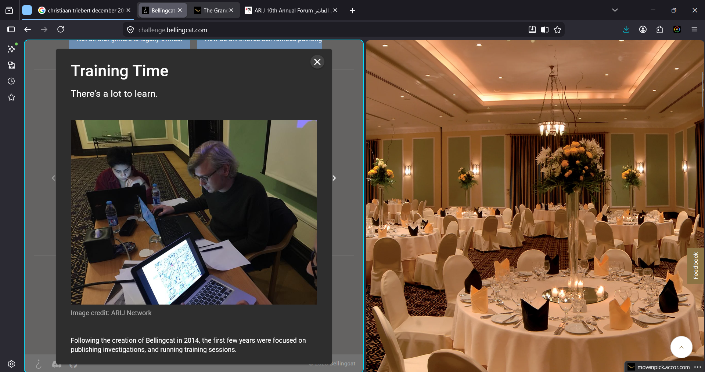
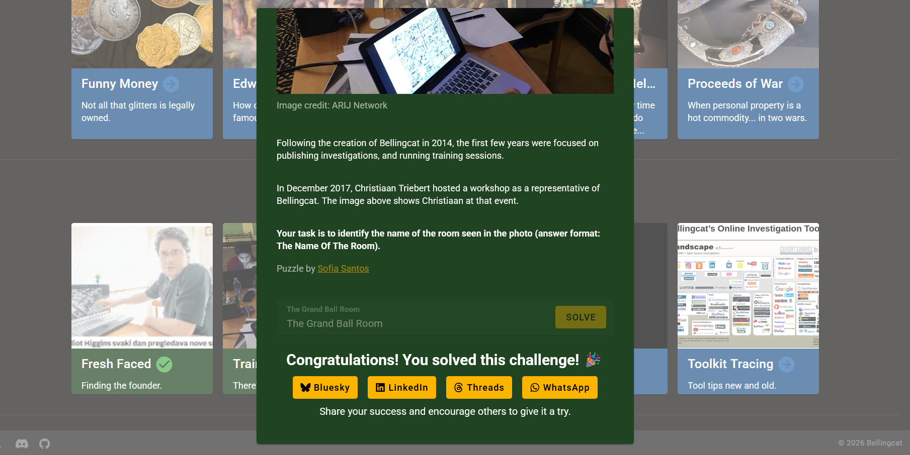

**Answer:** `The Grand Ball Room`

---

## 3. Creating Community

**Task:** Your task is to determine how many minutes passed between the server's creation and the official announcement on Twitter (answer format: `87`).

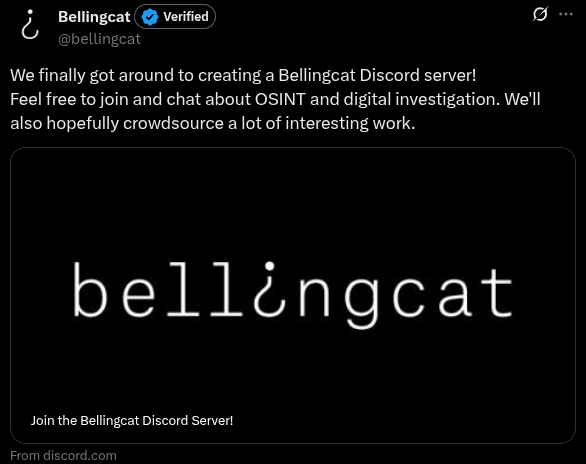

The first thing I did, of course, was find the original source. We don't need fancy Google dorking methods here; all I did was search `"Bellingcat Discord Server Creation"`. I scrolled for a little bit and found the original post.

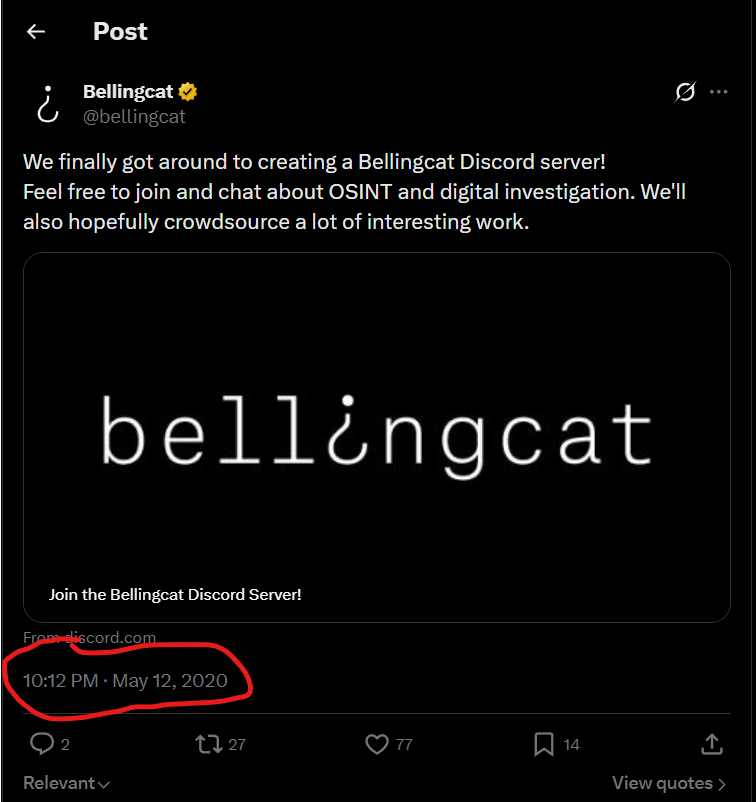

The Twitter post was made on **May 12, 2020, at 2:12 PM**. To get the exact creation date of the Bellingcat Discord Server, I grabbed the Discord server's ID and pasted it into a Snowflake-to-Timestamp converter site.

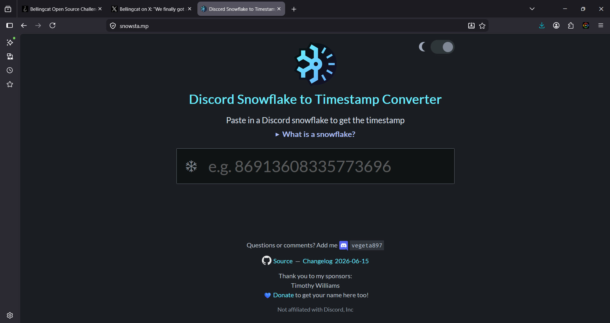

The result (ISO 8601): `2020-05-12T13:04:34.178Z`

Now let's compare it to the Twitter date and calculate the duration:
* **Twitter Time:** 14:12 (Converted to 24-Hour Format)
* **Discord Time:** 13:04

Site used for calculation: [Time Duration Calculator](https://www.calculator.net/time-duration-calculator.html)

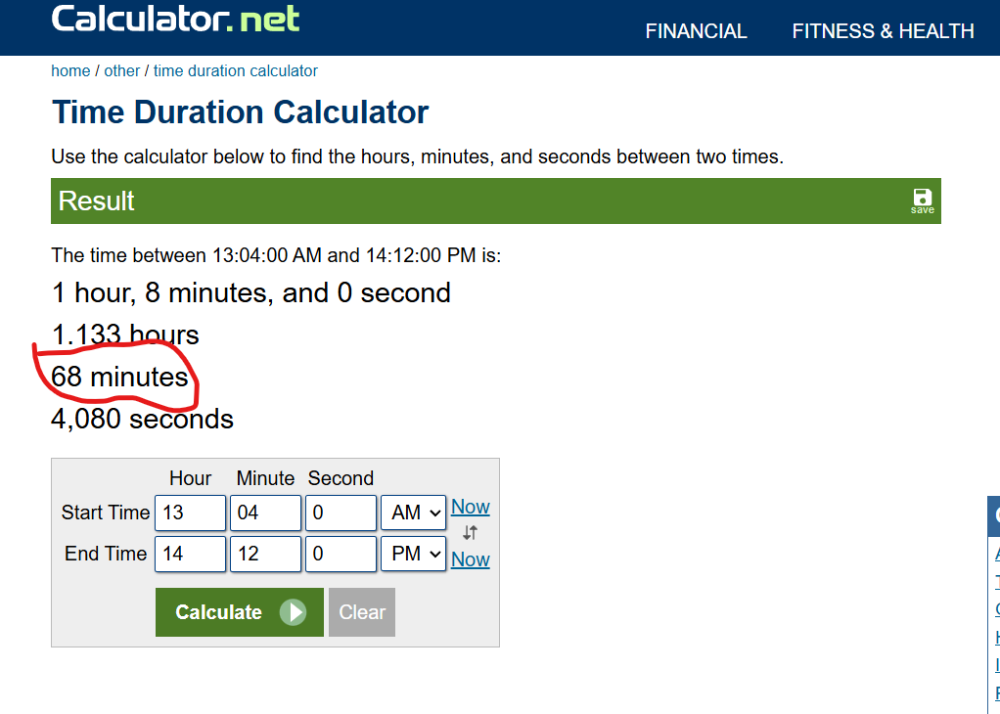
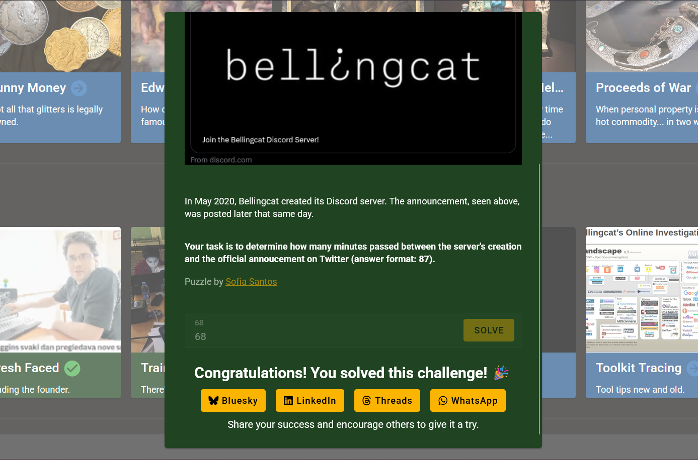

**Answer:** `68`

---

## 4. Future Plans

**Goal:** Your task is to find the article they published closest to when the document was created, and provide its last word (answer format: `word`).

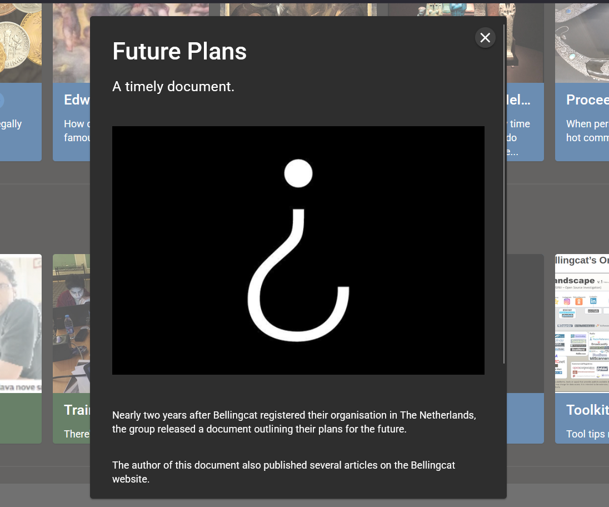

To make the search easier, I searched for the registration date of Bellingcat in the Netherlands.

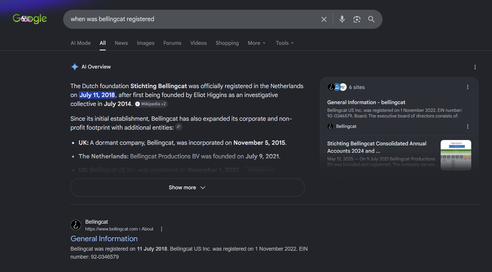

* **Date:** July 11, 2018

Then, I tried a bit of Google sorcery.

* **First attempt:** `("bellingcat" AND "plans") after:2020-06-01 before:2020-08-01 site:bellingcat.com filetype:pdf`
  * *Result:* None
* **Attempt 2:** `("bellingcat") after:2020-01-01 before:2020-12-01 site:bellingcat.com filetype:pdf`
  * *Result:* None

I tried doing this for a while with no luck. I also tried different query structures, but still nothing, so I pivoted to a different approach.

> ### 💡 Quick Interlude: What am I doing?
> Basically, what I'm doing is called **Google Dorking**. It's the use of advanced search operators to find information that might be buried or unintentionally left exposed. 
> 
> My logic here: Since the registration date of Bellingcat is 2018, and the challenge states that a document outlining their future plans was released *2 years later*, then $2018 + 2 = 2020$. 
> 
> Here is a breakdown of the filters I used to isolate 2020 document files:
> * `site:` — Restricts results entirely to `bellingcat.com`.
> * `after:` & `before:` — Restricts results to a specific timeframe (formatted as `YYYY-MM-DD` or `YYYY`).
> * `filetype:` — Restricts results to target file extensions like `pdf`, `docx`, `xlsx`, etc.
> * `""` — Triggers an exact match filter to ensure the terms appear verbatim.
> * `()` — Groups multiple terms or logical operators together.

Anyway, the initial dorks didn't work, so I simplified the tactic and tried this specific query:

`("future" AND "bellingcat" AND "plans") filetype:pdf site:bellingcat.com`

And I got results:

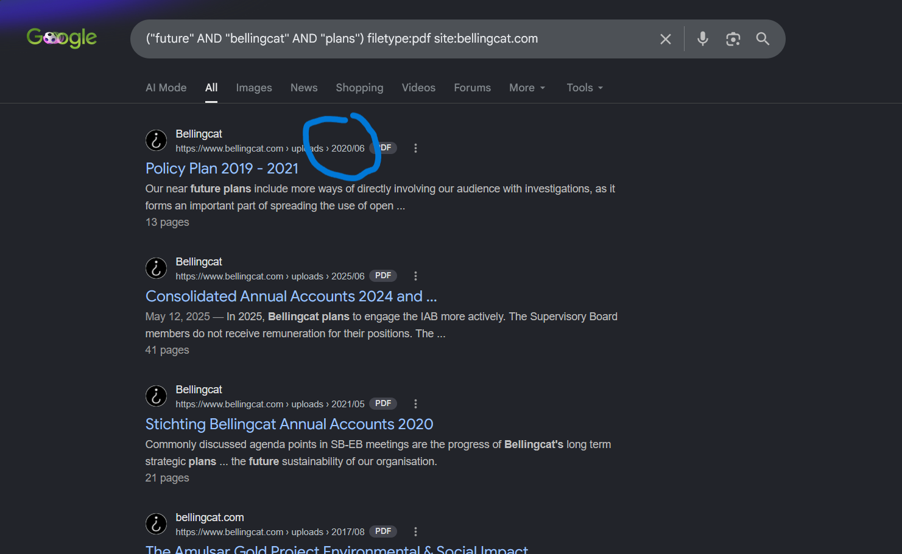

As you can see in the screenshot, the closest match is the **Policy Plan 2019-2021**, dated **June 2020**.

[Bellingcat Policy Plan 2019-2021 PDF](https://www.bellingcat.com/app/uploads/2020/06/Bellingcat-Policy-Plan-2019-2021.pdf)

After reading through to confirm if it was correct, I found this line in the text: 
> *"Our near future plans include more ways of directly involving our audience with investigations, as it forms an important part of spreading the use of open source investigation."*

I opened the document properties and found that the author is **Aric Toler**, and the creation date is **June 22, 2020**.

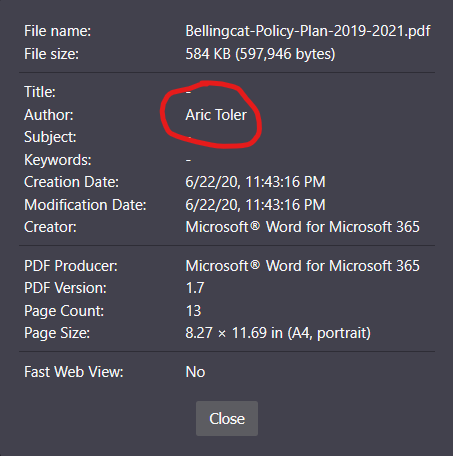

I searched his name to confirm that he is an author at Bellingcat.

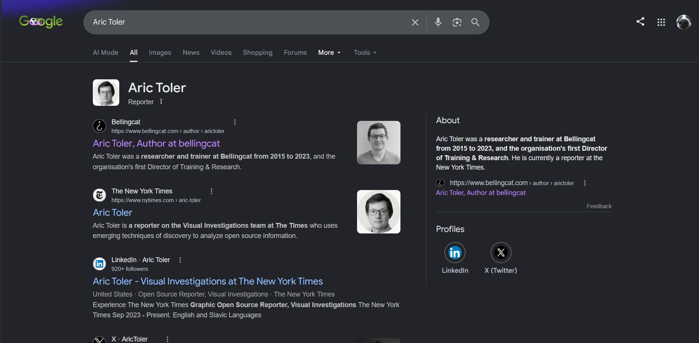

Checking his articles, I found a piece published on **April 15, 2020**, which is the closest publication date to the document's creation date.

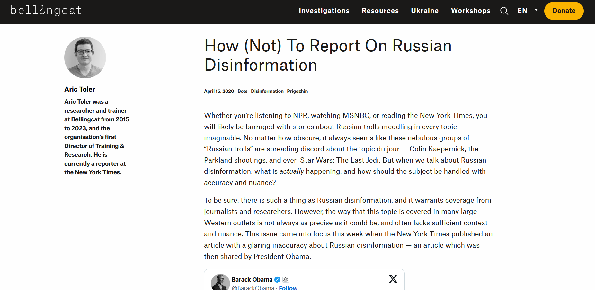

From there, all I had to do was scroll down to the very end of the article and grab the final word.

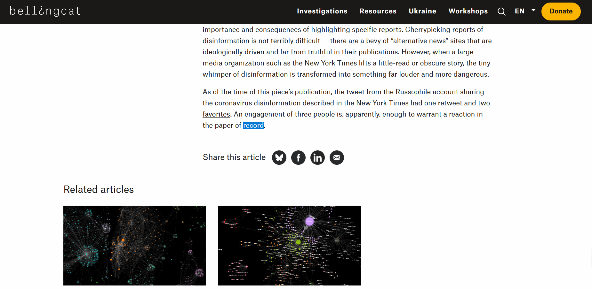
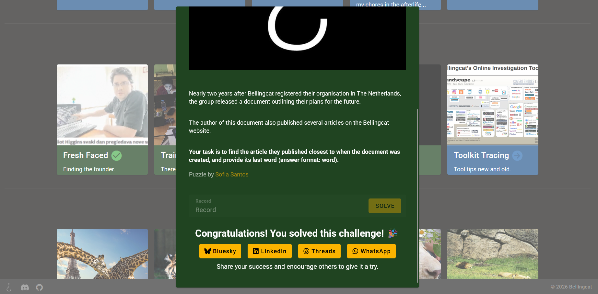

**Answer:** `record`

---

## 5. Toolkit Tracing

**Task:** Your task is to identify the type of hazard listed at the top of the table on page 39 within that document (answer format: `Word`).

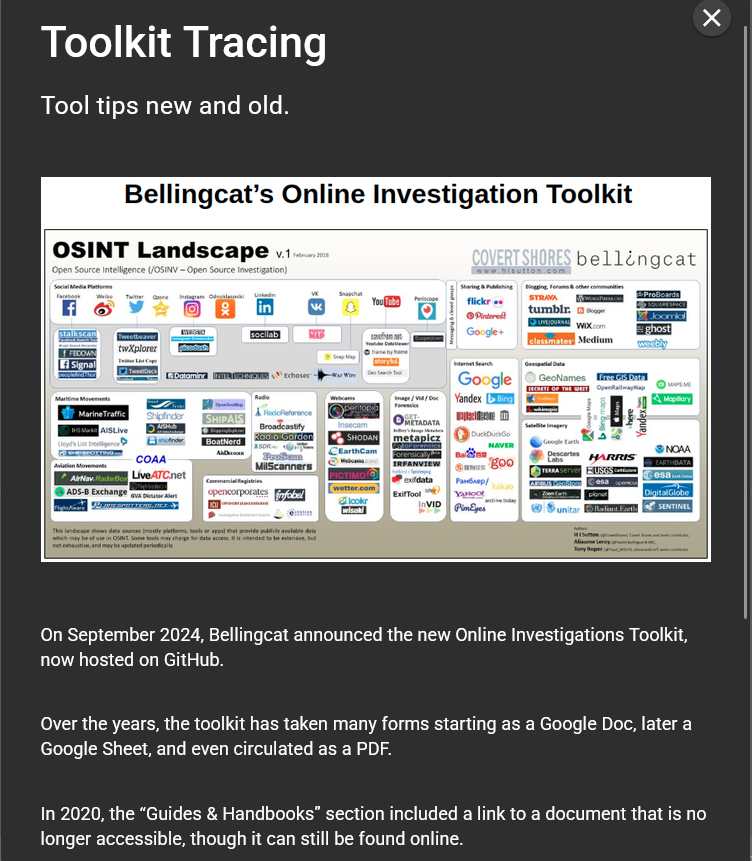

With this challenge, I immediately tried this search query:

`("Online Investigation Toolkit" AND "Bellingcat") after:2019 before:2021 filetype:pdf`

This gave me two results:

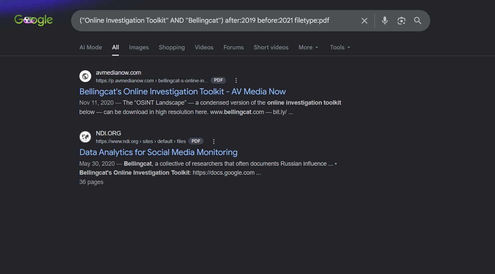

I clicked on the first PDF file and immediately scrolled to the **Guides & Handbooks** section of the document.

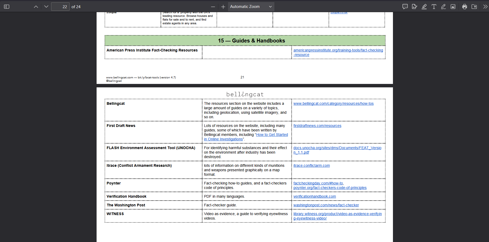

While checking the contents of the table, only one entry contained a PDF file link.

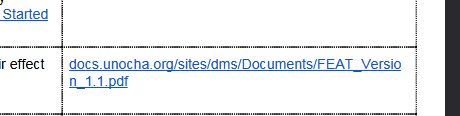

When checking the file link today, it's broken:
`https://docs.unocha.org/sites/dms/Documents/FEAT_Version_1.1.pdf`

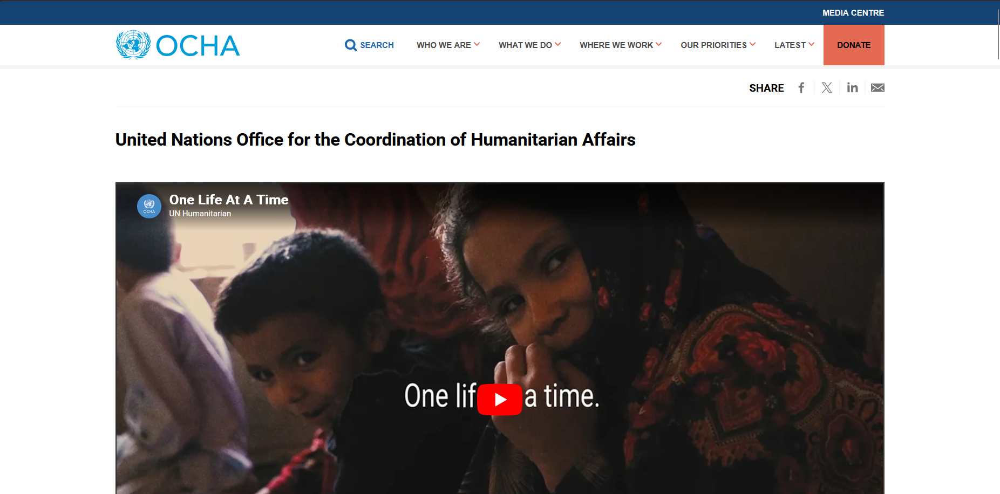

But I was certain this was the file I needed because the challenge details stated: *"the “Guides & Handbooks” section included a link to a document that is no longer accessible, though it can still be found online."*

So, I searched for this archived file with the specific query:

`("Unocha" AND "FEAT_Version_1.1.pdf")`

I included the organization name and exact filename hoping it hadn't changed.

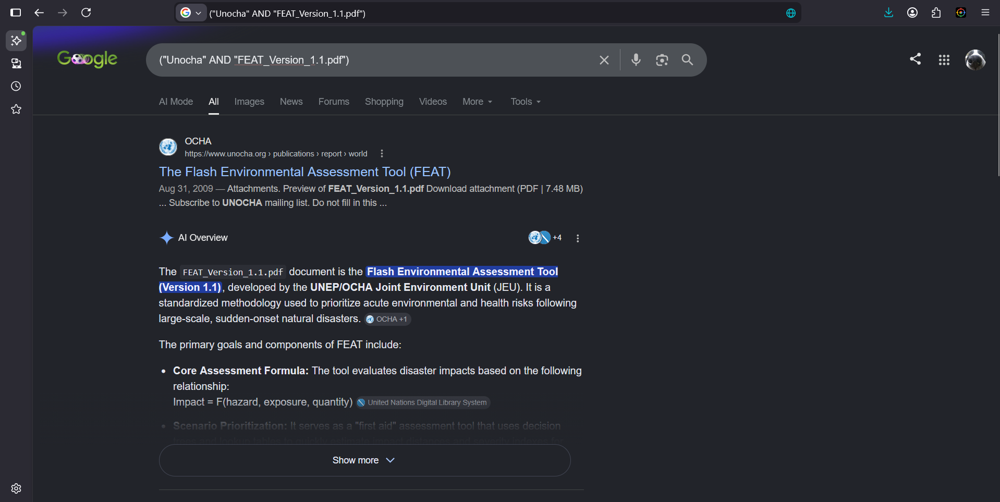

Turns out I was right! I found a downloadable PDF with the exact same filename.

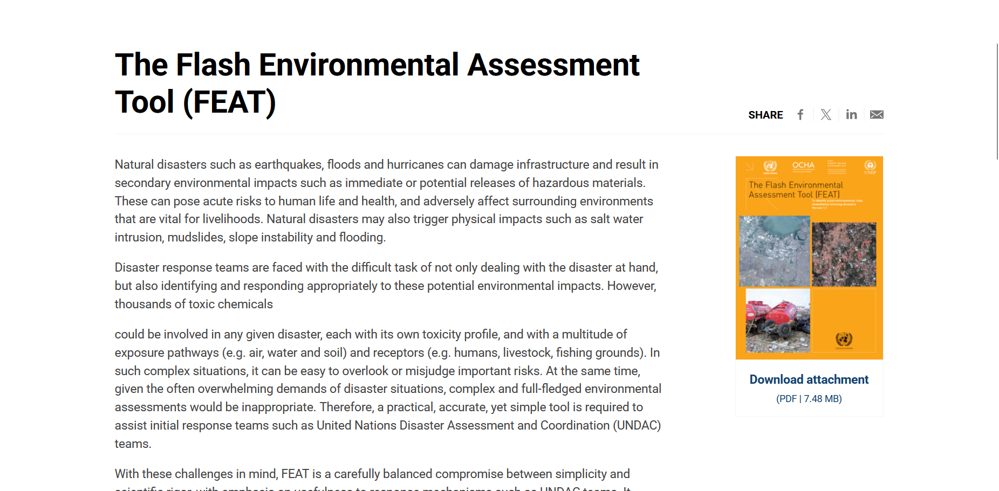
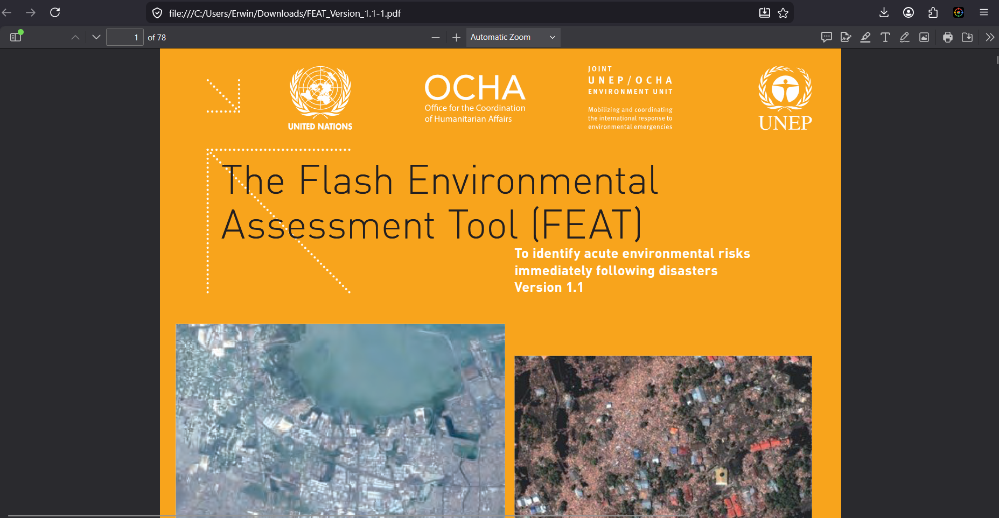

Now all I had to do was scroll to **page 39** and check the hazard listed at the top of the list.

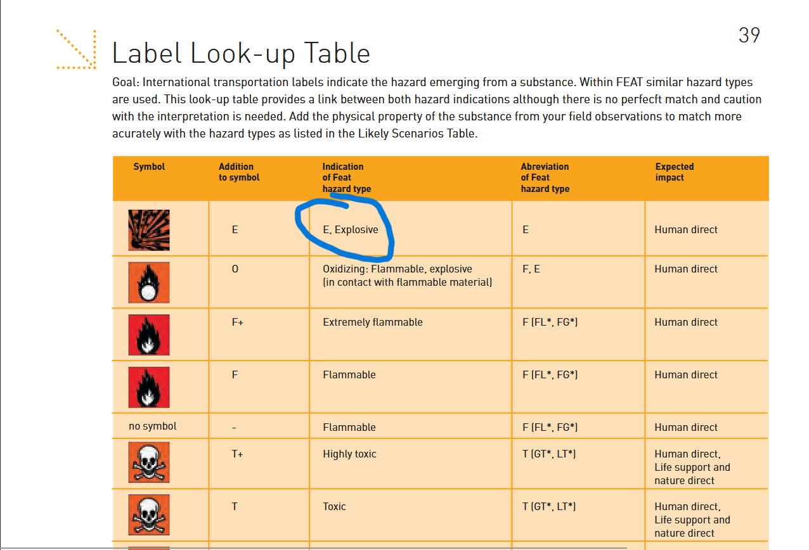
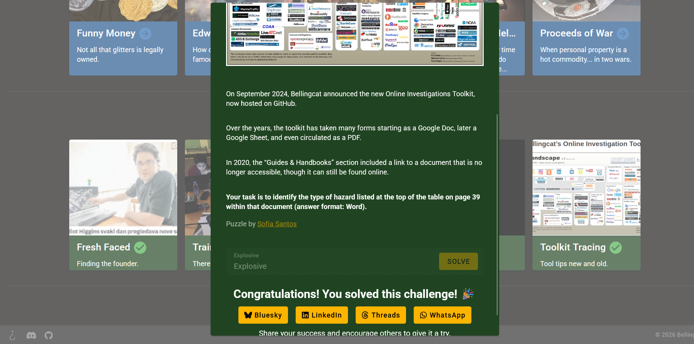

**Answer:** `Explosive`

---

## Conclusion

It took me quite a while to complete these challenges. I ran into plenty of dead ends, made wrong assumptions, and had to change my approach more than once. It's fun though, and it made the experience very enjoyable. Every failed assumption taught me to investigate more carefully.

This was my first OSINT write-up. There's still a lot to learn, and it's great to have an organization like Bellingcat, along with other free OSINT resources, that make it possible to practice these skills safely and publicly. 

I'll definitely do this again. I want to keep improving my investigative skills and sharing my write-ups in the future.

Love  Erwin
